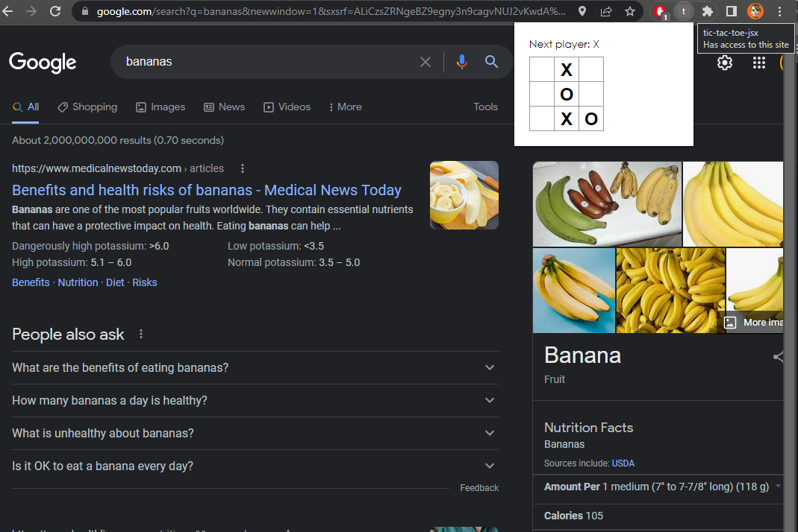

# `react-tic-tac-toe-jsx-app`

Followed the ["Tutorial: Intro to React"](https://reactjs.org/tutorial/tutorial.html) tutorial to make this application

## History

See [HISTORY](./HISTORY.md)

## 'To-Do's

See [TODO](./TODO.md)s

## Setup

### First time

```bash
$> npm run setup
```

It mainly installs global dependencies

### Dependencies

```bash
$> npm install
```

## Development

### Test

`FIXME` not working

```bash
$> npm test
```

### R&D

```bash
$> npm start
```

This will host the app in http://localhost:3000

## Build: `build/`

```bash
$> npm run build
```

## `chrome-extension`

Simply Load the generated `build/` folder from either `chrome` or `edge` `extensions`

### `manifest.json`

We were able to make this application a browser extension by simply including a `manifest.json` file inside `public/` folder. NOTE: since there was already a `manifest.json` there, this later was renamed as `manifest.react.json`. Moreover, there were attempts of merging the 2 of them, but the `chrome-extension` spec (`"manifest_version": 3`) seems to differ from the one react uses (`v2` perhaps?)

### `chrome/background/service_worker.js`

This file also gets included from `public/` folder as a static file, and its meant to be vanilla JS that gets executed as a background service.

Ideally, we would also compile this as any other modern application.

See [TODO](./TODO.md)s for more information

### React Routing

Since we were not able to use [`react-router(-dom)`](https://github.com/remix-run/react-router), React's defacto's routing library; we had to resort to [`react-chrome-extension-router`](https://github.com/kelsonpw/react-chrome-extension-router).

### Browsers

#### `chrome`


